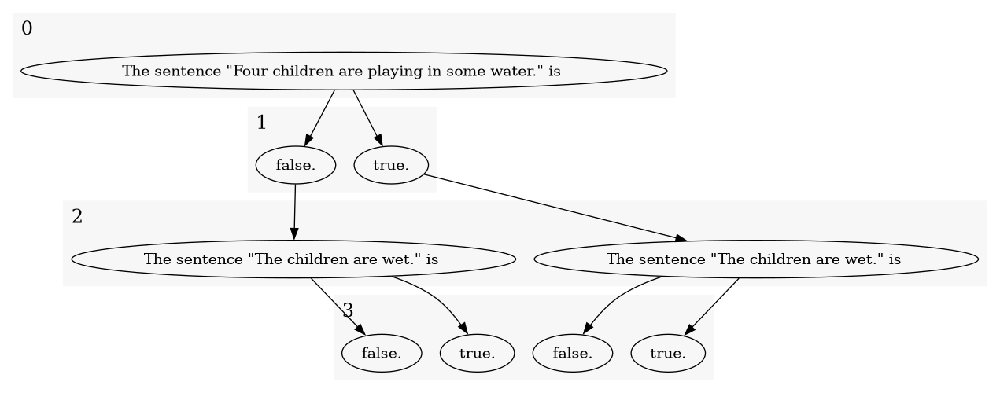
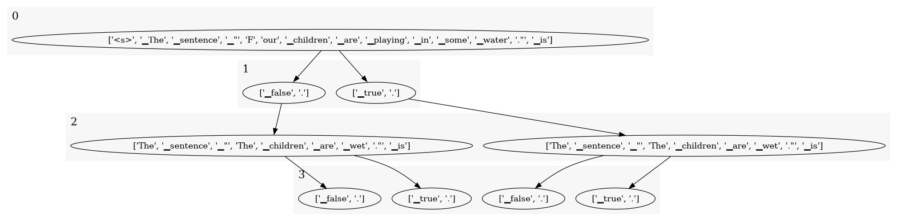
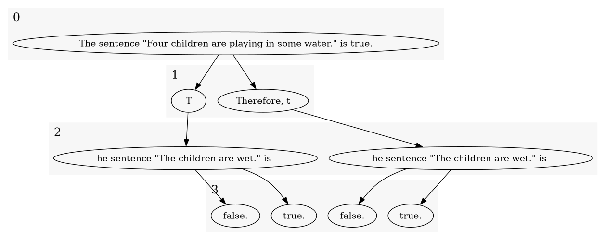
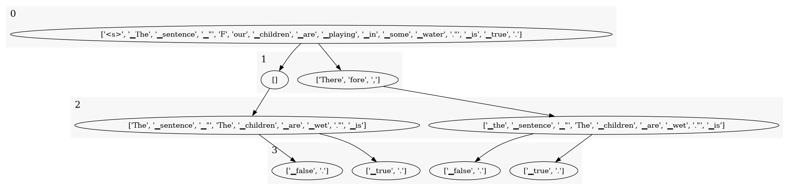

# the Tokens we have In Common

Tokens-In-Common is a package to facilitate efficient autoregressive language model inference on multiple variants of 
the same text that differ from each other in pivotal ways, but nonetheless have a (large) part of their 
*tokens in common*.

The primary use case kept in mind when developing this package is to study the downstream effects of choosing one 
word/phrase/answer/etc. over another.

The package allows you to represent such texts as graphs such as these:

This package allows you to construct such trees easily from the data and substitutions you have in mind.

A naive and inefficient way to apply autoregressive LMs on such trees would be to apply it to each branch independently.
But, this would mean that the earlier parts of the text, which many variants have in common, would be processed multiple
times unnecessarily.

Instead, we can change the attention mask to forward the model on entire trees at a time.
We do this by having each branch in the tree only attend to the tokens that precede it in its own branch.

But, before we can do this, we have to tokenize the text

This step should be as effortless as it is normally. 
Even when tokens are formed from characters in multiple vertices in the graph, such as in the example below:

|                        Text                         |                        Tokens                         |
|:---------------------------------------------------:|:-----------------------------------------------------:|
|  |  |

## Workflow
 - Create Multitree representation from (unicode) text, using ...;
 - Provide the tokenizer of choice which will be used to build a multitree of tokens;
 - Convert the multitree of tokens to tensors of input_ids, position_ids, and attention_mask (specifying attention between each pair of tokens);
 - Call huggingface implementation of choice 

Also see the `examples/` directory.
